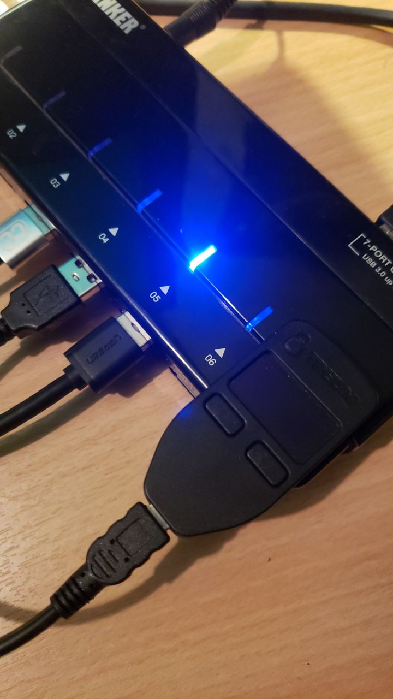
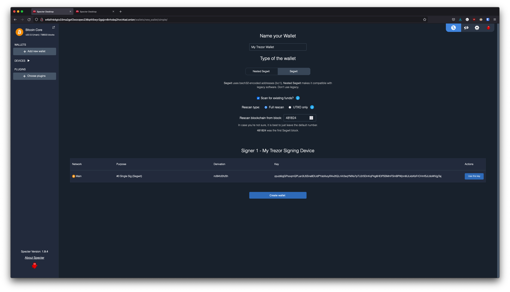

# Using a Signing Device with Specter

There are two ways to add a wallet to Specter. Some signing devices permit "air gap" which means transferring the xpub (and subsequent unsigned/signed transactions) back and forth between Specter and the signing device via an SD card (Coldcard for example) - other devices require a direct USB connection between the device and Specter (Trezor One for example).

## USB Connected Signing Devices:

For devices like the Trezor One, air gapping is not possible. This means importing xpubs via USB - Specter permits this via the HWI which requires running a second instance of Specter on your *local* machine (i.e *not* your Embassy).

Start by heading to Specter running on your Embassy (you can use either Tor or LAN - if you are accessing your Embassy over LAN the Launch UI button will open up the LAN interface for Specter - if you're accessing over Tor it will open up the Tor interface).

Click on the cog in the top right, or "Update your settings"

<!-- MD_PACKER_INLINE BEGIN -->

<!-- MD_PACKER_INLINE END -->

Click "USB devices" and then "Remote Specter USB connection"

<!-- MD_PACKER_INLINE BEGIN -->

<!-- MD_PACKER_INLINE END -->

Click "copy" under step 2

<!-- MD_PACKER_INLINE BEGIN -->

<!-- MD_PACKER_INLINE END -->

Now start Specter on your *local* machine (**not** your embassy) by either installing the application [here](https://specter.solutions) or run it in the background by following the instructions [here](https://github.com/cryptoadvance/specter-desktop#installing-specter-from-pip)

Once it's up and running, Head to the HWI settings here - http://127.0.0.1:25441/hwi/settings/

<!-- MD_PACKER_INLINE BEGIN -->

<!-- MD_PACKER_INLINE END -->

Paste in the domain that you copied from Specter running on your Embassy and click Update

<!-- MD_PACKER_INLINE BEGIN -->

<!-- MD_PACKER_INLINE END -->

Now connect your Trezor One or other signing device to your local machine

<!-- MD_PACKER_INLINE BEGIN -->

<!-- MD_PACKER_INLINE END -->

Head back to Specter on your Embassy

Click "Save Changes"

Then "Test connection"

You should see this along the top of the screen:

<!-- MD_PACKER_INLINE BEGIN -->

<!-- MD_PACKER_INLINE END -->

**Note:** At current time of writing, you must hit save **before** hitting test connection.

You can now click "Add new device" and select the type of signing device you're using (in this case, a Trezor)

<!-- MD_PACKER_INLINE BEGIN -->

<!-- MD_PACKER_INLINE END -->

Name the device

And click "Get via USB"

<!-- MD_PACKER_INLINE BEGIN -->

<!-- MD_PACKER_INLINE END -->

You may be asked for your PIN and passphrase here, and you may need to confirm extraction on the signing device

Specter will then begin extracting the public key(s) from your device

<!-- MD_PACKER_INLINE BEGIN -->

<!-- MD_PACKER_INLINE END -->

You may not want all the default types of extended public key. Remove/keep the ones you want by clicking "edit"

Click "Continue"

You can now "Add new wallet" or "create single key wallet."

(If you want to create a multisig wallet, add another device first, and make sure you generated an xpub intented for multisig on the first device, then come back to this step.)

Select the device (or devices if you are making a multisig wallet) that you want to use.

Name the wallet and select the key(s) you want to use.

<!-- MD_PACKER_INLINE BEGIN -->

<!-- MD_PACKER_INLINE END -->

Select "Scan for existing funds" if you have already used this wallet and wish to establish the transaction history, if this is a brand new wallet this is not necessary.

Click continue

If you select "rescan" you can refresh the page and watch as your bitcoin node rescans the blockchain for your wallet's history.

## Air Gapped Signing Devices

This part of the guide will go over how to upload an xpub from a device that permits air gapping - in this case a Coldcard.

Power up the Coldcard, enter your pin and any passphrase necessary.

Go down to "Advanced", "MicroSD card", "Export Wallet", "Generic JSON"

Remove the SD card from your Coldcard and insert it into your *local* machine (not the Embassy)

Go back to Specter on your Embassy and click "Add new device"

Click Coldcard (or whatever signing device you are using that permits airgapping)

Name the device

Click "Upload from SD card", navitage to the SD card and select "coldcard-export.json" and click open

You may not want all the default types of extended public key. Remove/keep the ones you want by clicking "edit"

Click "Continue"

You can now "Add new wallet" or "create single key wallet."

(If you want to create a multisig wallet, add another device first, and make sure you generated an xpub intented for multisig on the first device, then come back to this step.)

Select the device (or devices if you are making a multisig wallet) that you want to use.

Name the wallet and select the key you want to use.

Select "Scan for existing funds" if you have already used this wallet and wish to establish the transaction history, if this is a brand new wallet this is not necessary.

Click continue

If you select "rescan" you can refresh the page and watch as your bitcoin node rescans the blockchain for your wallet's history.
